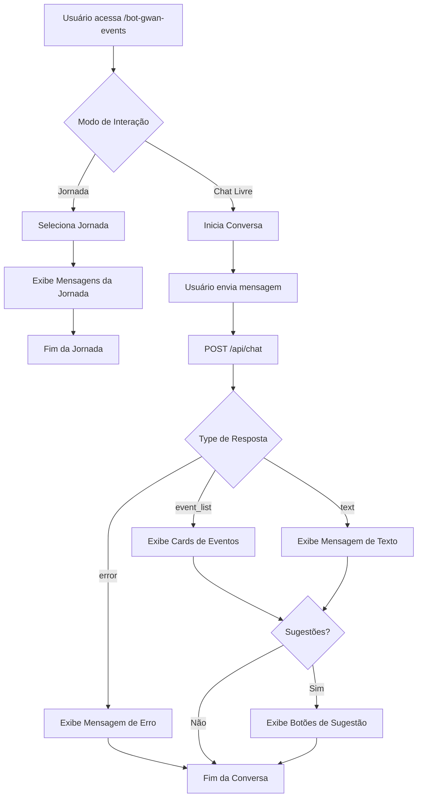
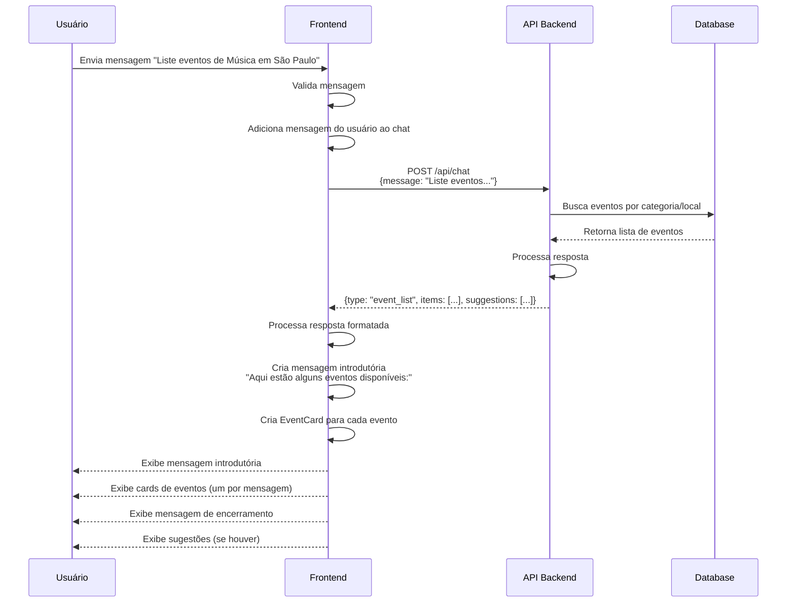
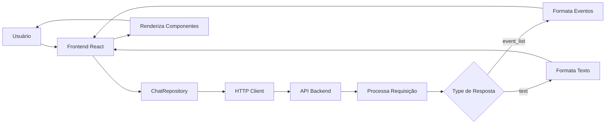

# Casos de Uso - Gwan Events

## Introdução

O **Gwan Events** é um chatbot especializado em eventos, projetado para ajudar usuários a descobrir, comprar ingressos e avaliar eventos.

### Características

- **Interface**: WhatsApp-style com PhoneMockup
- **Endpoint**: `https://api-events.gwan.com.br/api/chat`
- **Tecnologias**: React, TypeScript, Axios
- **Componentes**: EventCard, ChatInterface, PhoneMockup

### Propósito

O chatbot Gwan Events auxilia usuários em:
- Descoberta de eventos
- Recomendação de eventos personalizados
- Compra de ingressos
- Feedback pós-evento
- Avaliação de eventos
- Continuidade e notificações

## Jornadas de Conversação

O chatbot possui **6 jornadas** pré-definidas que demonstram diferentes cenários de uso:

1. **Descoberta** - Primeiro contato e entendimento dos objetivos do usuário
2. **Recomendação de Eventos** - Apresentação de eventos recomendados
3. **Compra de Ingresso** - Processo de compra de ingresso
4. **Pós-Evento** - Feedback após o evento
5. **Avaliação** - Solicitação de avaliação do evento
6. **Continuidade** - Agradecimento e sugestão de próximos eventos

## Diagrama Flowchart - Visão Geral



## Diagrama Sequence - Detalhes Técnicos



## Casos de Uso Detalhados

### Caso de Uso 1: Descoberta

**Descrição**: Primeiro contato e entendimento dos objetivos do usuário

**Pré-condições**:
- Usuário acessou a página `/bot-gwan-events`
- Chatbot está online e funcional
- API backend está disponível

**Fluxo Principal**:
1. Usuário inicia conversa expressando interesse em eventos
2. Chatbot responde com boas-vindas e solicita o nome
3. Usuário fornece seu nome (ex: "Pedro")
4. Chatbot apresenta opções:
   - Ver eventos disponíveis
   - Saber mais sobre categorias
   - Ajuda para encontrar eventos do interesse
5. Usuário escolhe "Ajuda para encontrar eventos do meu interesse"
6. Chatbot lista categorias (Shows, Esportes, Conferências, etc.)
7. Usuário seleciona categoria (ex: "Shows e música")
8. Chatbot confirma e oferece mostrar eventos

**Pós-condições**:
- Usuário recebeu orientação sobre busca
- Chatbot identificou categoria de interesse
- Pronto para exibir eventos correspondentes

**Exemplo de Conversa**:
```
Usuário: Oi, tudo bem? Vi o Gwan Eventos e queria entender melhor como funciona.

Chatbot: Olá! Seja muito bem-vindo ao Gwan Eventos. 😊
         É um prazer enorme falar com você.
         Aqui você encontra eventos incríveis e pode comprar ingressos de forma fácil e segura.
         Para deixar sua experiência mais personalizada, posso saber seu nome?

Usuário: Claro, meu nome é Pedro.

Chatbot: Ótimo, Pedro. Obrigado pela confiança.
         Fico feliz que tenha nos procurado — muitas pessoas chegam até nós buscando eventos interessantes.
         Para começarmos, me diga: o que você busca hoje?
         Você prefere:
         1️⃣ Ver eventos disponíveis,
         2️⃣ Saber mais sobre categorias de eventos,
         3️⃣ Ou prefere que eu te ajude a encontrar eventos do seu interesse?

Usuário: Acho que preciso de ajuda para encontrar eventos do meu interesse.

Chatbot: Perfeito, Pedro.
         Isso é mais comum do que imagina — e é exatamente por isso que existe o Gwan Eventos.
         Quando converso com pessoas que buscam eventos, normalmente os interesses caem em uma destas categorias:
         • Shows e música
         • Eventos esportivos
         • Conferências e palestras
         • Festivais e feiras
         • Eventos corporativos
         • Workshops e cursos
         Algum desses te representa hoje?

Usuário: Sim, shows e música. Gosto muito de música ao vivo.

Chatbot: Excelente, Pedro. Já estamos no caminho certo.
         Com base nisso, posso te mostrar os melhores shows disponíveis e ajudar você a escolher o ingresso ideal.
         Quer que eu faça isso?

Usuário: Sim, por favor.
```

### Caso de Uso 2: Recomendação de Eventos

**Descrição**: Apresentação de eventos recomendados

**Pré-condições**:
- Categoria de interesse foi identificada
- Chatbot está funcional

**Fluxo Principal**:
1. Chatbot analisa interesse do usuário
2. Chatbot busca eventos na API
3. Chatbot apresenta eventos recomendados em cards
4. Usuário pode solicitar detalhes de evento específico
5. Chatbot fornece informações detalhadas

**Pós-condições**:
- Eventos recomendados foram exibidos
- Usuário visualizou detalhes do evento escolhido
- Pronto para compra de ingresso

### Caso de Uso 3: Compra de Ingresso

**Descrição**: Processo de compra de ingresso

**Pré-condições**:
- Evento foi selecionado
- Ingressos estão disponíveis

**Fluxo Principal**:
1. Usuário demonstra interesse em evento
2. Chatbot solicita quantidade de ingressos
3. Usuário informa quantidade
4. Chatbot processa compra na API
5. Chatbot exibe valor total
6. Usuário confirma compra
7. Chatbot gera QR Code e envia por e-mail

**Pós-condições**:
- Compra foi confirmada
- QR Code foi gerado
- Ingressos foram enviados por e-mail

**Exemplo de Conversa**:
```
Chatbot: Para comprar o ingresso, preciso saber quantos ingressos você deseja.
         Você pode escolher:
         • 1 ingresso
         • 2 ingressos
         • 3 ou mais ingressos
         Quantos você precisa?

Usuário: Preciso de 2 ingressos.

Chatbot: Perfeito! 2 ingressos para o Festival de Música Indie.
         Vou processar sua compra agora mesmo.

Chatbot: ⏳ 2 minutos depois
         Ótima notícia: seus ingressos estão disponíveis!
         Valor total: R$ 150,00 (2 ingressos)
         Deseja confirmar a compra?

Usuário: Sim, pode confirmar.

Chatbot: Ótimo, compra confirmada! ✔️
         Aqui está o seu QR Code para entrada:
         📱 [QR Code enviado]
         E também já enviei para o seu e-mail os ingressos com todas as informações.
         Se precisar de mais alguma coisa, é só me chamar por aqui. Estou à disposição.
```

### Caso de Uso 4: Pós-Evento

**Descrição**: Feedback após o evento

**Pré-condições**:
- Usuário participou do evento
- Evento foi concluído

**Fluxo Principal**:
1. Usuário fornece feedback positivo
2. Chatbot agradece e solicita avaliação
3. Usuário pode aceitar ou recusar avaliar

**Pós-condições**:
- Feedback foi recebido
- Avaliação pode ser iniciada

### Caso de Uso 5: Avaliação

**Descrição**: Solicitação de avaliação do evento

**Pré-condições**:
- Usuário participou do evento
- Chatbot solicitou avaliação

**Fluxo Principal**:
1. Chatbot solicita avaliação do evento
2. Chatbot explica o que pode ser avaliado
3. Usuário confirma que vai avaliar
4. Chatbot agradece pela avaliação

**Pós-condições**:
- Avaliação foi iniciada
- Feedback será útil para outros usuários

### Caso de Uso 6: Continuidade

**Descrição**: Agradecimento e sugestão de próximos eventos

**Pré-condições**:
- Usuário participou de evento
- Chatbot quer manter engajamento

**Fluxo Principal**:
1. Usuário agradece pela experiência
2. Chatbot agradece e oferece notificações
3. Usuário aceita receber notificações
4. Chatbot confirma e se despede

**Pós-condições**:
- Notificações foram configuradas
- Relacionamento foi mantido
- Próximos eventos serão comunicados

## Integrações e Endpoints

### Endpoint da API

**URL**: `https://api-events.gwan.com.br/api/chat`

**Método**: `POST`

**Headers**:
```
Content-Type: application/json
Accept: application/json
```

**Request Body**:
```json
{
  "message": "Liste eventos de Música em São Paulo"
}
```

**Response Body** (Exemplo - event_list):
```json
{
  "answer": "...",
  "formattedResponse": {
    "answer": "...",
    "data": {
      "type": "event_list",
      "items": [
        {
          "id": "event-123",
          "title": "Festival de Música Indie",
          "description": "...",
          "date": "2024-02-15",
          "location": "Centro de Convenções",
          "address": "Rua Exemplo, 123",
          "city": "São Paulo",
          "state": "SP",
          "image": "https://...",
          "category": "Shows e Música",
          "organizerName": "Produtora XYZ",
          "maxCapacity": 5000,
          "soldTickets": 3500,
          "eventLink": "https://events.gwan.com.br/event/event-123"
        }
      ],
      "suggestions": [...]
    }
  }
}
```

### Tratamento de Respostas

O frontend processa diferentes tipos de resposta:

1. **event_list**: Exibe cards de eventos usando `EventCard`
2. **text**: Exibe mensagem de texto formatada
3. **error**: Exibe mensagem de erro amigável

### Componentes Visuais

#### EventCard
Componente React que exibe informações de um evento em formato de card:
- Imagem do evento
- Título e categoria
- Data formatada
- Localização (endereço, cidade, estado)
- Organizador
- Capacidade e ingressos vendidos
- Link para página do evento

#### ChatInterface
Componente principal que gerencia:
- Exibição de mensagens
- Envio de mensagens
- Processamento de respostas da API
- Renderização de cards de eventos
- Sugestões interativas

#### PhoneMockup
Componente que simula interface de smartphone WhatsApp.

## Fluxo de Dados



## Configuração

### Variáveis de Ambiente

- **Desenvolvimento**: `VITE_GWAN_EVENTS_CHAT_URL=http://localhost:3010/api`
- **Produção**: `VITE_GWAN_EVENTS_CHAT_URL=https://api-events.gwan.com.br/api`

### Arquivos Relacionados

- **Página**: `src/pages/bots/BotGwanEventsPage.tsx`
- **Jornadas**: `src/data/chat/journeys.json`
- **Hook**: `src/application/chat/useInteractions.ts`
- **Selector**: `src/presentation/chatbot-showcase/InteractionsSelector.tsx`
- **Componente Card**: `src/presentation/chatbot-showcase/EventCard.tsx`

