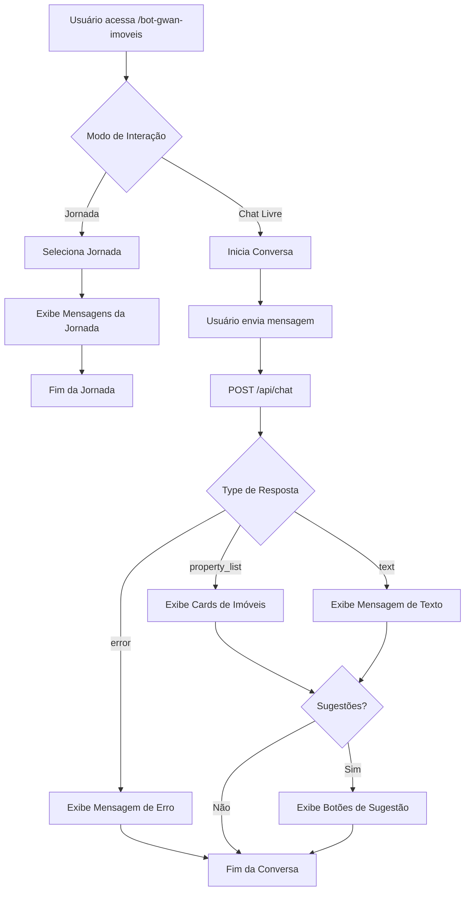
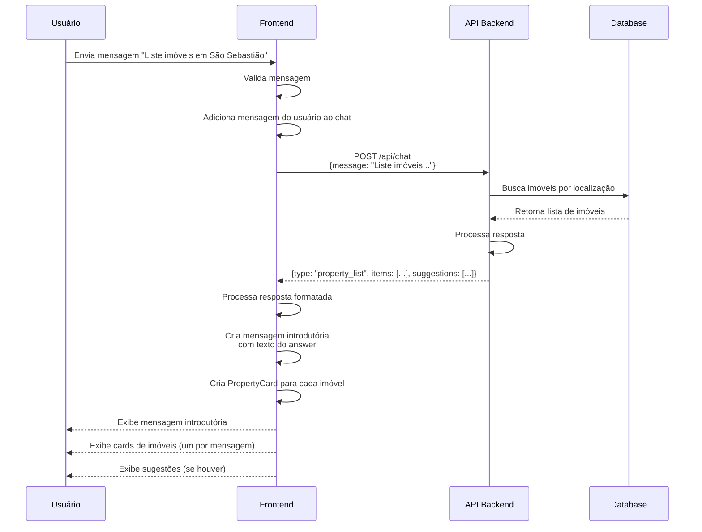
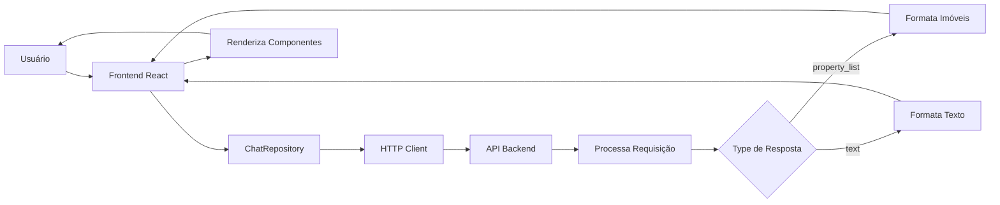

# Casos de Uso - Gwan Imóveis

## Introdução

O **Gwan Imóveis** é um chatbot especializado em imóveis, projetado para auxiliar usuários na busca, compra, venda e aluguel de propriedades.

### Características

- **Interface**: WhatsApp-style com PhoneMockup
- **Endpoint**: `https://api-imoveis.gwan.com.br/api/chat`
- **Tecnologias**: React, TypeScript, Axios
- **Componentes**: PropertyCard, ChatInterface, PhoneMockup

### Propósito

O chatbot Gwan Imóveis auxilia usuários em:
- Busca e descoberta de imóveis
- Agendamento de visitas
- Informações sobre financiamento
- Documentação necessária
- Características de propriedades
- Processo de compra e venda

## Jornadas de Conversação

O chatbot possui **6 jornadas** pré-definidas que demonstram diferentes cenários de uso:

1. **Busca de Imóveis** - Primeiro contato e entendimento das necessidades do cliente
2. **Agendamento de Visita** - Processo de agendamento de visita ao imóvel
3. **Informações sobre Financiamento** - Esclarecimento de dúvidas sobre financiamento imobiliário
4. **Documentação** - Esclarecimento sobre documentos necessários
5. **Características do Imóvel** - Detalhamento das características de uma propriedade
6. **Processo de Compra/Venda** - Etapas do processo de compra e venda de imóvel

## Diagrama Flowchart - Visão Geral



## Diagrama Sequence - Detalhes Técnicos



## Casos de Uso Detalhados

### Caso de Uso 1: Busca de Imóveis

**Descrição**: Primeiro contato e entendimento das necessidades do cliente

**Pré-condições**:
- Usuário acessou a página `/bot-gwan-imoveis`
- Chatbot está online e funcional
- API backend está disponível

**Fluxo Principal**:
1. Usuário inicia conversa expressando interesse em imóvel
2. Chatbot responde com boas-vindas e solicita o nome
3. Usuário fornece seu nome (ex: "Ana")
4. Chatbot apresenta opções:
   - Ver imóveis disponíveis para compra
   - Saber mais sobre financiamento
   - Ajuda para encontrar imóveis do interesse
5. Usuário escolhe "Ajuda para encontrar imóveis do meu interesse"
6. Chatbot lista categorias (Apartamentos, Casas, Terrenos, etc.)
7. Usuário seleciona tipo (ex: "Apartamento para comprar")
8. Chatbot confirma e oferece mostrar imóveis

**Pós-condições**:
- Usuário recebeu orientação sobre busca
- Chatbot identificou tipo de imóvel desejado
- Pronto para exibir imóveis correspondentes

**Exemplo de Conversa**:
```
Usuário: Olá, estou procurando um imóvel para comprar.

Chatbot: Olá! Seja muito bem-vindo ao Gwan Imóveis. 😊
         É um prazer enorme falar com você.
         Aqui você encontra os melhores imóveis e posso te ajudar a encontrar a propriedade ideal.
         Para deixar sua busca mais personalizada, posso saber seu nome?

Usuário: Claro, meu nome é Ana.

Chatbot: Ótimo, Ana. Obrigado pela confiança.
         Fico feliz que tenha nos procurado — muitas pessoas chegam até nós buscando o imóvel perfeito.
         Para começarmos, me diga: o que você busca hoje?
         Você prefere:
         1️⃣ Ver imóveis disponíveis para compra
         2️⃣ Saber mais sobre financiamento
         3️⃣ Ou prefere que eu te ajude a encontrar imóveis do seu interesse?

Usuário: Acho que preciso de ajuda para encontrar imóveis do meu interesse.

Chatbot: Perfeito, Ana.
         Isso é mais comum do que imagina — e é exatamente por isso que existe o Gwan Imóveis.
         Quando converso com pessoas que buscam imóveis, normalmente as necessidades caem em algumas categorias:
         • Apartamentos
         • Casas
         • Terrenos
         • Comércio
         • Aluguel
         • Compra
         Qual dessas opções te representa hoje?

Usuário: Estou procurando um apartamento para comprar.

Chatbot: Excelente, Ana. Já estamos no caminho certo.
         Com base nisso, posso te mostrar os melhores apartamentos disponíveis e ajudar você a escolher o imóvel ideal.
         Quer que eu faça isso?

Usuário: Sim, por favor.
```

### Caso de Uso 2: Agendamento de Visita

**Descrição**: Processo de agendamento de visita ao imóvel

**Pré-condições**:
- Imóvel foi identificado e recomendado
- Usuário demonstrou interesse

**Fluxo Principal**:
1. Chatbot apresenta imóveis recomendados
2. Usuário demonstra interesse em imóvel específico
3. Chatbot solicita agendamento de visita
4. Usuário confirma interesse em agendar
5. Chatbot solicita disponibilidade (manhã, tarde, finais de semana)
6. Usuário informa preferência
7. Chatbot verifica disponibilidade e oferece horários
8. Usuário escolhe horário
9. Chatbot confirma agendamento e envia detalhes por e-mail

**Pós-condições**:
- Visita foi agendada
- Detalhes foram enviados por e-mail
- Corretor foi notificado

### Caso de Uso 3: Informações sobre Financiamento

**Descrição**: Esclarecimento de dúvidas sobre financiamento imobiliário

**Pré-condições**:
- Usuário está interessado em comprar imóvel
- Usuário precisa de financiamento

**Fluxo Principal**:
1. Usuário solicita informações sobre financiamento
2. Chatbot solicita informações:
   - Valor do imóvel
   - Valor da entrada
   - Renda mensal
3. Usuário fornece informações
4. Chatbot calcula e apresenta opções:
   - Financiamento pelo SFH
   - Financiamento pela Caixa
   - Comparação de taxas e parcelas
5. Usuário escolhe opção para detalhar
6. Chatbot explica requisitos e documentação
7. Chatbot oferece ajudar a iniciar processo

**Pós-condições**:
- Opções de financiamento foram apresentadas
- Requisitos foram explicados
- Processo pode ser iniciado

### Caso de Uso 4: Documentação

**Descrição**: Esclarecimento sobre documentos necessários

**Pré-condições**:
- Usuário está em processo de compra
- Documentação é necessária

**Fluxo Principal**:
1. Usuário solicita informações sobre documentação
2. Chatbot lista documentos do comprador
3. Chatbot lista documentos do imóvel
4. Usuário pode solicitar detalhes sobre documento específico
5. Chatbot explica documento em detalhes

**Pós-condições**:
- Lista completa de documentos foi fornecida
- Documentos foram explicados
- Usuário sabe o que precisa providenciar

### Caso de Uso 5: Características do Imóvel

**Descrição**: Detalhamento das características de uma propriedade

**Pré-condições**:
- Imóvel foi identificado
- Usuário demonstrou interesse

**Fluxo Principal**:
1. Usuário solicita detalhes sobre imóvel específico
2. Chatbot exibe características completas:
   - Área total e privativa
   - Número de quartos e banheiros
   - Vagas de garagem
   - Amenidades do condomínio
   - Valores (preço, condomínio, IPTU)
3. Usuário pode fazer perguntas específicas
4. Chatbot responde detalhadamente

**Pós-condições**:
- Características completas foram apresentadas
- Dúvidas foram esclarecidas
- Usuário tem informações suficientes para decisão

### Caso de Uso 6: Processo de Compra/Venda

**Descrição**: Etapas do processo de compra e venda de imóvel

**Pré-condições**:
- Usuário está interessado em comprar
- Negociação foi iniciada

**Fluxo Principal**:
1. Usuário solicita informações sobre processo
2. Chatbot explica etapas:
   - Negociação e proposta
   - Documentação
   - Contrato de compra e venda
   - Financiamento (se aplicável)
   - Escritura e registro
3. Usuário pode solicitar detalhes de etapa específica
4. Chatbot explica prazos e requisitos
5. Chatbot oferece ajudar a organizar documentação

**Pós-condições**:
- Processo completo foi explicado
- Prazos foram informados
- Próximos passos foram definidos

## Integrações e Endpoints

### Endpoint da API

**URL**: `https://api-imoveis.gwan.com.br/api/chat`

**Método**: `POST`

**Headers**:
```
Content-Type: application/json
Accept: application/json
```

**Request Body**:
```json
{
  "message": "Liste imóveis em São Sebastião"
}
```

**Response Body** (Exemplo - property_list):
```json
{
  "answer": "...",
  "formattedResponse": {
    "answer": "...",
    "data": {
      "type": "property_list",
      "items": [
        {
          "id": "b18c8880-5a09-4b9c-9fa4-a208bc02642b",
          "title": "Apartamento 3 quartos - Centro",
          "type": "Apartamento",
          "purpose": "SALE",
          "price": 500000,
          "city": "São Paulo",
          "neighborhood": "Centro",
          "area": 120,
          "bedrooms": 3,
          "bathrooms": 2,
          "garageSpaces": 2,
          "amenities": ["hasPool", "hasGarden"],
          "coverImageUrl": "https://...",
          "url": "https://imoveis.gwan.com.br/property/b18c8880-5a09-4b9c-9fa4-a208bc02642b"
        }
      ],
      "suggestions": [...]
    }
  }
}
```

### Tratamento de Respostas

O frontend processa diferentes tipos de resposta:

1. **property_list**: Exibe cards de imóveis usando `PropertyCard`
2. **text**: Exibe mensagem de texto formatada
3. **error**: Exibe mensagem de erro amigável

### Componentes Visuais

#### PropertyCard
Componente React que exibe informações de um imóvel em formato de card:
- Imagem do imóvel
- Título e tipo
- Finalidade (Aluguel/Venda)
- Preço formatado
- Localização (bairro, cidade)
- Área em m²
- Número de quartos, banheiros e vagas
- Amenidades formatadas
- Link para página de detalhes

#### ChatInterface
Componente principal que gerencia:
- Exibição de mensagens
- Envio de mensagens
- Processamento de respostas da API
- Renderização de cards de imóveis
- Sugestões interativas

#### PhoneMockup
Componente que simula interface de smartphone WhatsApp.

## Fluxo de Dados



## Configuração

### Variáveis de Ambiente

- **Desenvolvimento**: `VITE_GWAN_IMOVEIS_CHAT_URL=http://localhost:3009/api`
- **Produção**: `VITE_GWAN_IMOVEIS_CHAT_URL=https://api-imoveis.gwan.com.br/api`

### Arquivos Relacionados

- **Página**: `src/pages/bots/BotGwanImoveisPage.tsx`
- **Jornadas**: `src/data/chat/imoveis-journeys.json`
- **Hook**: `src/application/chat/useImoveisInteractions.ts`
- **Selector**: `src/presentation/chatbot-showcase/ImoveisInteractionsSelector.tsx`
- **Componente Card**: `src/presentation/chatbot-showcase/PropertyCard.tsx`

