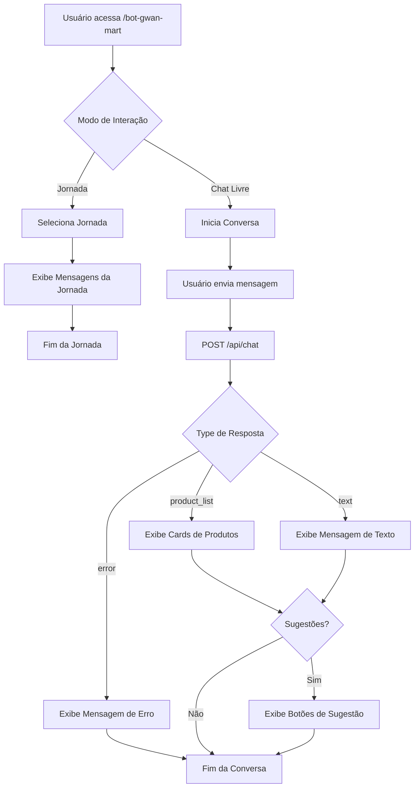
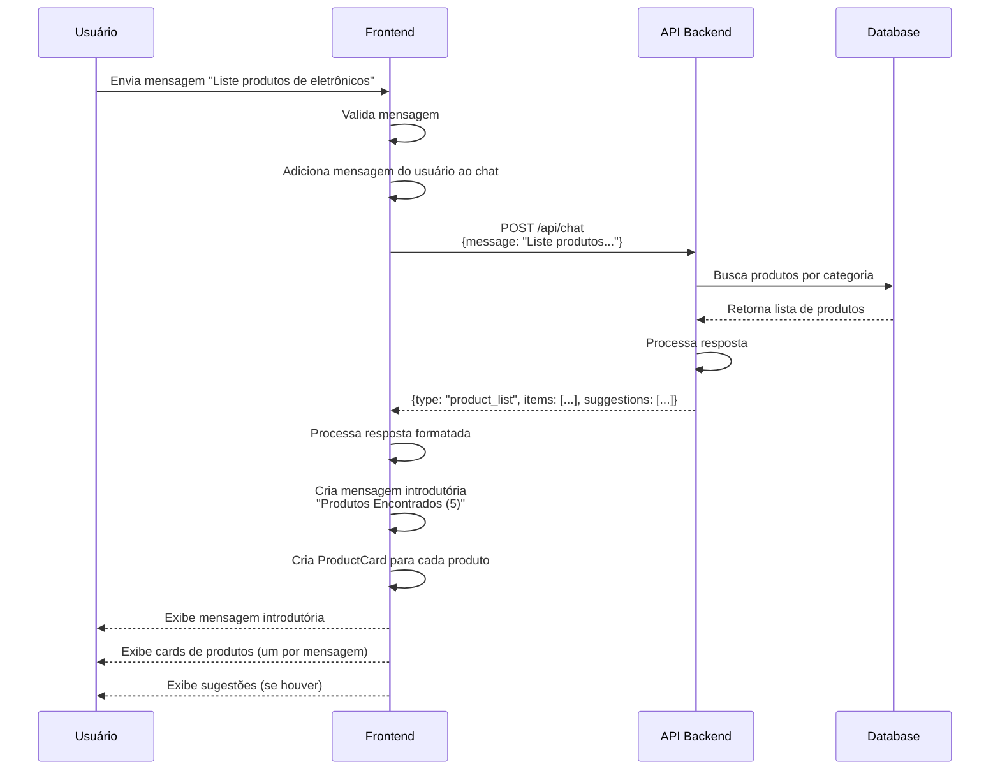
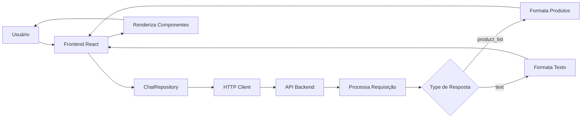

# Casos de Uso - Gwan Mart

## Introdução

O **Gwan Mart** é um chatbot especializado em e-commerce, projetado para fornecer atendimento ao cliente completo, desde a busca de produtos até o suporte pós-venda.

### Características

- **Interface**: WhatsApp-style com PhoneMockup
- **Endpoint**: `https://api-mart.gwan.com.br/api/chat`
- **Tecnologias**: React, TypeScript, Axios
- **Componentes**: ProductCard, ChatInterface, PhoneMockup

### Propósito

O chatbot Gwan Mart auxilia usuários em:
- Busca e descoberta de produtos
- Consulta de pedidos e status
- Rastreamento de entregas
- Políticas de troca e devolução
- Suporte técnico
- Recomendações personalizadas

## Jornadas de Conversação

O chatbot possui **6 jornadas** pré-definidas que demonstram diferentes cenários de uso:

1. **Busca de Produtos** - Primeiro contato e busca de produtos no e-commerce
2. **Informações sobre Pedido** - Consulta sobre status e detalhes de um pedido
3. **Rastreamento de Pedido** - Acompanhamento e rastreamento de pedido em trânsito
4. **Política de Troca e Devolução** - Esclarecimento sobre políticas de troca e devolução
5. **Suporte Técnico** - Atendimento para dúvidas técnicas sobre produtos
6. **Recomendações Personalizadas** - Sistema de recomendações baseado em preferências do usuário

## Diagrama Flowchart - Visão Geral



## Diagrama Sequence - Detalhes Técnicos



## Casos de Uso Detalhados

### Caso de Uso 1: Busca de Produtos

**Descrição**: Primeiro contato e busca de produtos no e-commerce

**Pré-condições**:
- Usuário acessou a página `/bot-gwan-mart`
- Chatbot está online e funcional
- API backend está disponível

**Fluxo Principal**:
1. Usuário inicia conversa com "Olá, estou procurando um produto."
2. Chatbot responde com boas-vindas e solicita o nome do usuário
3. Usuário fornece seu nome (ex: "João")
4. Chatbot apresenta opções de busca:
   - Ver produtos disponíveis
   - Buscar por categoria
   - Ajuda para encontrar produtos do interesse
5. Usuário escolhe "Ajuda para encontrar produtos do meu interesse"
6. Chatbot lista categorias disponíveis
7. Usuário seleciona categoria (ex: "Eletrônicos")
8. Chatbot confirma e oferece mostrar produtos

**Pós-condições**:
- Usuário recebeu orientação sobre como buscar produtos
- Chatbot identificou a categoria de interesse
- Pronto para exibir produtos da categoria selecionada

**Exemplo de Conversa**:
```
Usuário: Olá, estou procurando um produto.
Chatbot: Olá! Seja muito bem-vindo ao Gwan Mart. 😊
         É um prazer enorme falar com você.
         Aqui você encontra os melhores produtos e posso te ajudar a encontrar exatamente o que você precisa.
         Para deixar sua busca mais personalizada, posso saber seu nome?

Usuário: Claro, meu nome é João.

Chatbot: Ótimo, João. Obrigado pela confiança.
         Fico feliz que tenha nos procurado — muitas pessoas chegam até nós buscando produtos de qualidade.
         Para começarmos, me diga: o que você busca hoje?
         Você prefere:
         1️⃣ Ver produtos disponíveis
         2️⃣ Buscar por categoria
         3️⃣ Ou prefere que eu te ajude a encontrar produtos do seu interesse?

Usuário: Acho que preciso de ajuda para encontrar produtos do meu interesse.

Chatbot: Perfeito, João.
         Isso é mais comum do que imagina — e é exatamente por isso que existe o Gwan Mart.
         Quando converso com pessoas que buscam produtos, normalmente os interesses caem em algumas categorias:
         • Eletrônicos
         • Roupas e Acessórios
         • Casa e Decoração
         • Beleza e Cuidados Pessoais
         • Esportes e Lazer
         • Livros e Mídia
         Qual dessas categorias te interessa mais?

Usuário: Estou procurando produtos de eletrônicos.

Chatbot: Excelente, João. Já estamos no caminho certo.
         Com base nisso, posso te mostrar os melhores produtos de eletrônicos disponíveis e ajudar você a escolher o ideal.
         Quer que eu faça isso?

Usuário: Sim, por favor.
```

### Caso de Uso 2: Informações sobre Pedido

**Descrição**: Consulta sobre status e detalhes de um pedido

**Pré-condições**:
- Usuário possui um pedido realizado
- Usuário tem número do pedido ou e-mail cadastrado

**Fluxo Principal**:
1. Usuário solicita informações sobre pedido
2. Chatbot solicita número do pedido ou e-mail
3. Usuário fornece número do pedido (ex: "12345")
4. Chatbot busca informações do pedido na API
5. Chatbot exibe:
   - Status do pedido
   - Itens do pedido
   - Valor total
   - Informações de envio
6. Usuário pode solicitar mais detalhes sobre envio
7. Chatbot fornece informações detalhadas de envio

**Pós-condições**:
- Usuário visualizou status completo do pedido
- Informações de envio foram fornecidas
- Código de rastreamento será enviado por e-mail quando disponível

**Exemplo de Conversa**:
```
Usuário: Quero saber sobre meu pedido.

Chatbot: Claro, João! Vou te ajudar com informações sobre seu pedido.
         Para localizar seu pedido, preciso de algumas informações:
         • Número do pedido
         • Ou seu e-mail cadastrado
         Você tem o número do pedido?

Usuário: Sim, o número é 12345.

Chatbot: Perfeito! Encontrei seu pedido #12345.
         📦 Status do Pedido:
         • Pedido confirmado em 15/01/2024
         • Pagamento aprovado
         • Produto em preparação para envio
         • Previsão de envio: 18/01/2024
         📋 Itens do Pedido:
         • 1x Smartphone XYZ - R$ 1.500,00
         • 1x Capa Protetora - R$ 50,00
         💰 Valor Total: R$ 1.550,00
         Quer saber mais sobre algum item específico ou sobre o envio?

Usuário: Quero saber sobre o envio.

Chatbot: Claro! Vou te passar todas as informações sobre o envio.
         🚚 Informações de Envio:
         • Método: Transportadora Express
         • Previsão de entrega: 20/01/2024
         • Endereço de entrega: Rua Exemplo, 123 - Centro, São Paulo/SP
         • Código de rastreamento: será enviado por e-mail quando o pedido for despachado
         Você receberá um e-mail com o código de rastreamento assim que o pedido sair do nosso estoque.
         Quer que eu te avise quando o pedido for enviado?
```

### Caso de Uso 3: Rastreamento de Pedido

**Descrição**: Acompanhamento e rastreamento de pedido em trânsito

**Pré-condições**:
- Pedido foi enviado
- Usuário possui código de rastreamento

**Fluxo Principal**:
1. Usuário solicita rastreamento de pedido
2. Chatbot explica formas de rastrear
3. Usuário fornece código de rastreamento
4. Chatbot consulta status na transportadora
5. Chatbot exibe:
   - Status atual
   - Última atualização
   - Localização atual
   - Previsão de entrega
   - Histórico de movimentação
6. Chatbot oferece configurar notificações
7. Usuário aceita receber notificações

**Pós-condições**:
- Usuário visualizou status completo do rastreamento
- Notificações foram configuradas
- Usuário receberá atualizações automáticas

### Caso de Uso 4: Política de Troca e Devolução

**Descrição**: Esclarecimento sobre políticas de troca e devolução

**Pré-condições**:
- Usuário possui produto adquirido
- Produto está dentro do prazo de 30 dias

**Fluxo Principal**:
1. Usuário solicita informações sobre troca/devolução
2. Chatbot explica política geral
3. Usuário indica que quer trocar produto
4. Chatbot solicita informações:
   - Número do pedido
   - Produto a trocar
   - Motivo
   - Produto desejado
5. Usuário fornece informações
6. Chatbot processa solicitação de troca
7. Chatbot informa próximos passos e código de postagem

**Pós-condições**:
- Solicitação de troca foi processada
- Usuário receberá código de postagem
- Processo de troca foi explicado

### Caso de Uso 5: Suporte Técnico

**Descrição**: Atendimento para dúvidas técnicas sobre produtos

**Pré-condições**:
- Usuário possui produto com problema técnico
- Produto está dentro do prazo de garantia

**Fluxo Principal**:
1. Usuário solicita suporte técnico
2. Chatbot solicita informações do produto e problema
3. Usuário descreve problema (ex: "Smartphone travando")
4. Chatbot sugere soluções rápidas
5. Usuário tenta soluções sem sucesso
6. Chatbot sugere soluções avançadas
7. Se necessário, chatbot oferece agendar assistência técnica
8. Usuário escolhe opção de assistência

**Pós-condições**:
- Soluções foram sugeridas
- Assistência técnica foi agendada (se necessário)
- Usuário tem opções de atendimento disponíveis

### Caso de Uso 6: Recomendações Personalizadas

**Descrição**: Sistema de recomendações baseado em preferências do usuário

**Pré-condições**:
- Usuário está buscando produtos
- Chatbot está funcional

**Fluxo Principal**:
1. Usuário solicita recomendações
2. Chatbot solicita informações:
   - Categorias de interesse
   - Orçamento
   - Produto específico
3. Usuário fornece preferências
4. Chatbot busca produtos na API
5. Chatbot exibe produtos recomendados em cards
6. Usuário seleciona produto de interesse
7. Chatbot exibe detalhes completos do produto

**Pós-condições**:
- Produtos recomendados foram exibidos
- Usuário visualizou detalhes do produto escolhido
- Pronto para finalizar compra

## Integrações e Endpoints

### Endpoint da API

**URL**: `https://api-mart.gwan.com.br/api/chat`

**Método**: `POST`

**Headers**:
```
Content-Type: application/json
Accept: application/json
```

**Request Body**:
```json
{
  "message": "Liste produtos de eletrônicos"
}
```

**Response Body** (Exemplo - product_list):
```json
{
  "answer": "## 🛍️ Produtos Encontrados (5)\n\n...",
  "formattedResponse": {
    "answer": "...",
    "data": {
      "type": "product_list",
      "items": [
        {
          "id": 1,
          "code": "PROD-001",
          "name": "Smartphone Galaxy Pro Max",
          "description": "...",
          "category": "Eletrônicos",
          "subcategory": "Smartphones",
          "originalPrice": 3999.99,
          "promotionalPrice": 3499.99,
          "discountPercentage": "12.50",
          "stock": 50,
          "thumbnail": "https://...",
          "realImage": "https://...",
          "averageRating": 4.7,
          "totalReviews": 234,
          "isFeatured": true,
          "url": "https://mart.gwan.com.br/products/PROD-001"
        }
      ],
      "pagination": {
        "current": 1,
        "total": 5,
        "pageSize": 5,
        "hasMore": false
      },
      "suggestions": [
        "Ver detalhes do produto \"Smartphone Galaxy Pro Max\"",
        "Ver detalhes de um produto",
        "Filtrar por categoria",
        "Filtrar por preço"
      ]
    }
  }
}
```

### Tratamento de Respostas

O frontend processa diferentes tipos de resposta:

1. **product_list**: Exibe cards de produtos usando `ProductCard`
2. **text**: Exibe mensagem de texto formatada
3. **error**: Exibe mensagem de erro amigável

### Componentes Visuais

#### ProductCard
Componente React que exibe informações de um produto em formato de card:
- Imagem do produto
- Badge de desconto (quando aplicável)
- Badge de destaque (quando aplicável)
- Nome e categoria
- Preço original e promocional
- Descrição
- Estoque disponível
- Avaliação e reviews
- Código do produto
- Link para página de detalhes

#### ChatInterface
Componente principal que gerencia:
- Exibição de mensagens
- Envio de mensagens
- Processamento de respostas da API
- Renderização de cards de produtos
- Sugestões interativas

#### PhoneMockup
Componente que simula interface de smartphone WhatsApp para melhor experiência do usuário.

## Fluxo de Dados



## Configuração

### Variáveis de Ambiente

- **Desenvolvimento**: `VITE_GWAN_MART_CHAT_URL=http://localhost:3009/api`
- **Produção**: `VITE_GWAN_MART_CHAT_URL=https://api-mart.gwan.com.br/api`

### Arquivos Relacionados

- **Página**: `src/pages/bots/BotGwanMartPage.tsx`
- **Jornadas**: `src/data/chat/mart-journeys.json`
- **Hook**: `src/application/chat/useMartInteractions.ts`
- **Selector**: `src/presentation/chatbot-showcase/MartInteractionsSelector.tsx`
- **Componente Card**: `src/presentation/chatbot-showcase/ProductCard.tsx`

