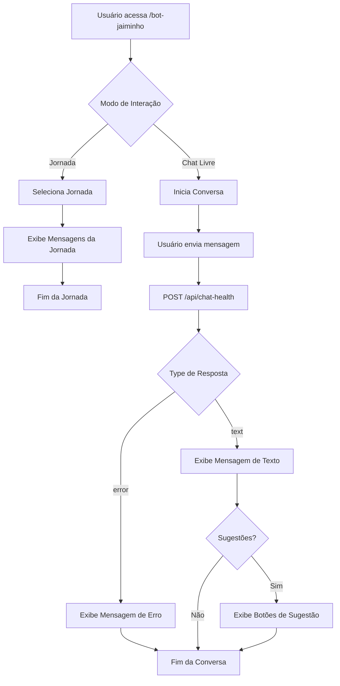
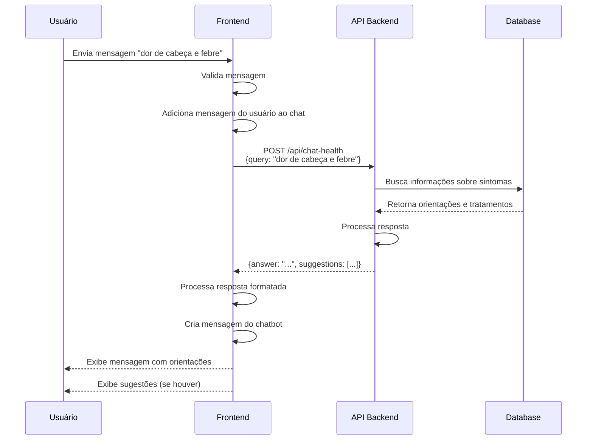
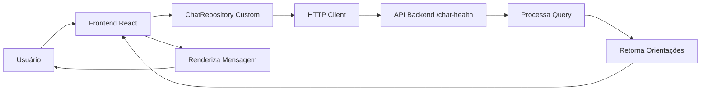

# Casos de Uso - Jaiminho

## Introdução

O **Jaiminho** é um chatbot especializado em saúde e naturopatia, projetado para fornecer orientações sobre tratamentos naturais, bem-estar e cuidados com a saúde.

### Características

- **Interface**: WhatsApp-style com PhoneMockup
- **Endpoint**: `https://api-events.gwan.com.br/api/chat-health`
- **Tecnologias**: React, TypeScript, Axios
- **Componentes**: ChatInterface, PhoneMockup

### Propósito

O chatbot Jaiminho auxilia usuários em:
- Primeira consulta e entendimento de sintomas
- Tratamento de problemas digestivos
- Tratamento de prisão de ventre
- Ansiedade e estresse
- Dores de cabeça
- Bem-estar geral e estilo de vida saudável

## Jornadas de Conversação

O chatbot possui **6 jornadas** pré-definidas que demonstram diferentes cenários de uso:

1. **Primeira Consulta** - Primeiro contato e entendimento dos sintomas do paciente
2. **Tratamento de Dor de Barriga** - Diagnóstico e tratamento natural para dor de barriga
3. **Tratamento de Prisão de Ventre** - Orientações naturais para prisão de ventre
4. **Ansiedade e Estresse** - Sintomas e tratamentos naturais para ansiedade
5. **Dores de Cabeça** - Causas e chás medicinais para dores de cabeça
6. **Bem-estar Geral** - Dicas de estilo de vida saudável

## Diagrama Flowchart - Visão Geral



## Diagrama Sequence - Detalhes Técnicos



## Casos de Uso Detalhados

### Caso de Uso 1: Primeira Consulta

**Descrição**: Primeiro contato e entendimento dos sintomas do paciente

**Pré-condições**:
- Usuário acessou a página `/bot-jaiminho`
- Chatbot está online e funcional
- API backend está disponível

**Fluxo Principal**:
1. Usuário inicia conversa relatando mal-estar
2. Chatbot se apresenta como Jaiminho e solicita nome
3. Usuário fornece seu nome (ex: "Maria")
4. Chatbot apresenta opções:
   - Descrever sintomas
   - Falar sobre problema específico
   - Ajuda para entender estado de saúde
5. Usuário escolhe "Descrever sintomas"
6. Chatbot lista categorias de sintomas
7. Usuário seleciona categoria (ex: "Problemas digestivos")
8. Chatbot confirma e oferece ajudar com tratamento natural

**Pós-condições**:
- Sintomas foram identificados
- Categoria foi definida
- Pronto para fornecer orientações

**Exemplo de Conversa**:
```
Usuário: Olá, estou me sentindo mal e gostaria de uma orientação.

Chatbot: Olá! Seja muito bem-vindo. 😊
         Sou o Jaiminho, seu assistente de saúde especializado em naturopatia.
         Estou aqui para te ajudar com orientações sobre bem-estar e tratamentos naturais.
         Para começar, posso saber seu nome?

Usuário: Claro, meu nome é Maria.

Chatbot: Ótimo, Maria. Obrigado pela confiança.
         Fico feliz que tenha nos procurado — muitas pessoas chegam até nós buscando alternativas naturais para cuidar da saúde.
         Para começarmos, me diga: o que você está sentindo hoje?
         Você prefere:
         1️⃣ Descrever seus sintomas
         2️⃣ Falar sobre um problema de saúde específico
         3️⃣ Ou prefere que eu te ajude a entender melhor seu estado de saúde?

Usuário: Acho que preciso descrever meus sintomas.

Chatbot: Perfeito, Maria.
         Isso é muito importante — entender os sintomas é o primeiro passo para um tratamento adequado.
         Quando converso com pessoas sobre saúde, normalmente os sintomas podem estar relacionados a:
         • Problemas digestivos
         • Dores e desconfortos
         • Ansiedade e estresse
         • Problemas de sono
         • Cansaço e fadiga
         • Outros sintomas
         Qual dessas categorias melhor descreve o que você está sentindo?

Usuário: Estou com problemas digestivos.

Chatbot: Entendi, Maria. Problemas digestivos são muito comuns.
         Com base nisso, posso te ajudar com orientações sobre tratamentos naturais e mudanças no estilo de vida que podem melhorar sua digestão.
         Quer que eu te ajude com isso?

Usuário: Sim, por favor.
```

### Caso de Uso 2: Tratamento de Dor de Barriga

**Descrição**: Diagnóstico e tratamento natural para dor de barriga

**Pré-condições**:
- Usuário está com dor de barriga
- Chatbot está funcional

**Fluxo Principal**:
1. Usuário relata dor de barriga
2. Chatbot solicita informações detalhadas:
   - Há quanto tempo
   - Tipo de dor (constante ou intermitente)
   - Sintomas associados
   - Alimentação recente
3. Usuário fornece informações
4. Chatbot sugere tratamentos naturais:
   - Chá de camomila
   - Chá de gengibre
   - Repouso e hidratação
5. Usuário escolhe tratamento para detalhar
6. Chatbot explica preparo e uso detalhado

**Pós-condições**:
- Tratamentos naturais foram sugeridos
- Instruções detalhadas foram fornecidas
- Usuário sabe como proceder

### Caso de Uso 3: Tratamento de Prisão de Ventre

**Descrição**: Orientações naturais para prisão de ventre

**Pré-condições**:
- Usuário está com prisão de ventre
- Chatbot está funcional

**Fluxo Principal**:
1. Usuário solicita tratamento para prisão de ventre
2. Chatbot solicita informações sobre o problema
3. Usuário fornece informações
4. Chatbot sugere soluções:
   - Aumentar ingestão de fibras
   - Hidratação
   - Chás medicinais
   - Atividade física
5. Usuário escolhe opção para detalhar
6. Chatbot explica em detalhes

**Pós-condições**:
- Soluções naturais foram apresentadas
- Instruções foram fornecidas
- Usuário tem plano de ação

### Caso de Uso 4: Ansiedade e Estresse

**Descrição**: Sintomas e tratamentos naturais para ansiedade

**Pré-condições**:
- Usuário está com sintomas de ansiedade
- Chatbot está funcional

**Fluxo Principal**:
1. Usuário solicita informações sobre ansiedade
2. Chatbot lista sintomas comuns
3. Usuário confirma sintomas
4. Chatbot sugere tratamentos:
   - Chás calmantes
   - Técnicas de relaxamento
   - Mudanças no estilo de vida
5. Usuário escolhe tratamento para detalhar
6. Chatbot explica preparo e uso

**Pós-condições**:
- Sintomas foram identificados
- Tratamentos foram sugeridos
- Instruções foram fornecidas

### Caso de Uso 5: Dores de Cabeça

**Descrição**: Causas e chás medicinais para dores de cabeça

**Pré-condições**:
- Usuário está com dor de cabeça
- Chatbot está funcional

**Fluxo Principal**:
1. Usuário solicita tratamento para dor de cabeça
2. Chatbot solicita informações sobre a dor
3. Usuário fornece detalhes
4. Chatbot identifica tipo de dor
5. Chatbot sugere chás medicinais:
   - Chá de hortelã
   - Chá de gengibre
   - Chá de camomila
   - Chá de erva-cidreira
6. Usuário escolhe chá para detalhar
7. Chatbot explica preparo completo

**Pós-condições**:
- Tipo de dor foi identificado
- Chá medicinal foi recomendado
- Instruções de preparo foram fornecidas

### Caso de Uso 6: Bem-estar Geral

**Descrição**: Dicas de estilo de vida saudável

**Pré-condições**:
- Usuário busca melhorar bem-estar
- Chatbot está funcional

**Fluxo Principal**:
1. Usuário solicita dicas de vida saudável
2. Chatbot solicita informações sobre estilo de vida atual
3. Usuário fornece informações
4. Chatbot oferece dicas em áreas:
   - Alimentação saudável
   - Atividade física
   - Sono de qualidade
5. Usuário escolhe área para detalhar
6. Chatbot explica princípios e práticas

**Pós-condições**:
- Dicas foram fornecidas
- Princípios foram explicados
- Usuário tem orientações práticas

## Integrações e Endpoints

### Endpoint da API

**URL**: `https://api-events.gwan.com.br/api/chat-health`

**Método**: `POST`

**Headers**:
```
Content-Type: application/json
Accept: application/json
```

**Request Body**:
```json
{
  "query": "dor de cabeça e febre"
}
```

**Response Body** (Exemplo):
```json
{
  "answer": "Com base nos sintomas que você descreveu (dor de cabeça e febre), vou te ajudar com algumas orientações naturais...",
  "suggestions": [
    "Quais chás são bons para febre?",
    "Como tratar dor de cabeça naturalmente?",
    "Quando procurar um médico?"
  ]
}
```

### Tratamento de Respostas

O frontend processa respostas do tipo:

1. **text**: Exibe mensagem de texto formatada com orientações
2. **error**: Exibe mensagem de erro amigável

**Nota**: O Jaiminho não utiliza cards específicos como os outros chatbots, focando em conversação textual com orientações de saúde.

### Componentes Visuais

#### ChatInterface
Componente principal que gerencia:
- Exibição de mensagens
- Envio de mensagens
- Processamento de respostas da API
- Sugestões interativas

#### PhoneMockup
Componente que simula interface de smartphone WhatsApp.

## Fluxo de Dados



## Configuração

### Variáveis de Ambiente

- **Desenvolvimento**: `VITE_CHAT_HEALTH_API_URL=http://localhost:3010/api/chat-health`
- **Produção**: `VITE_CHAT_HEALTH_API_URL=https://api-events.gwan.com.br/api/chat-health`

### Arquivos Relacionados

- **Página**: `src/pages/bots/BotJaiminhoPage.tsx`
- **Jornadas**: `src/data/chat/jaiminho-journeys.json`
- **Hook**: `src/application/chat/useJaiminhoInteractions.ts`
- **Selector**: `src/presentation/chatbot-showcase/JaiminhoInteractionsSelector.tsx`

### Observação Importante

O Jaiminho utiliza um formato de requisição diferente dos outros chatbots:
- **Payload**: `{query: "..."}` ao invés de `{message: "..."}`
- **Endpoint**: `/api/chat-health` ao invés de `/api/chat`
- **Repository Custom**: Implementação específica em `BotJaiminhoPage.tsx`

